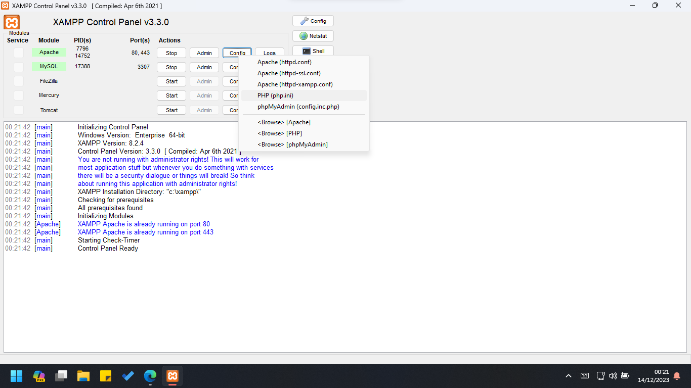
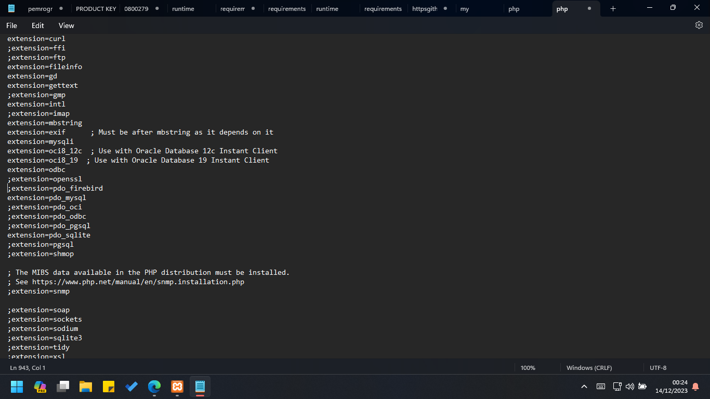
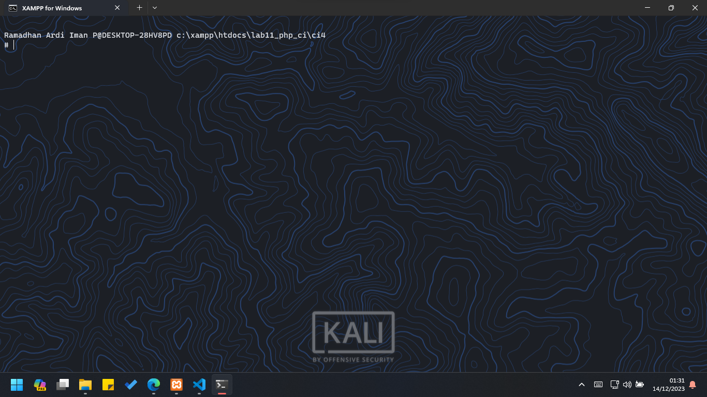
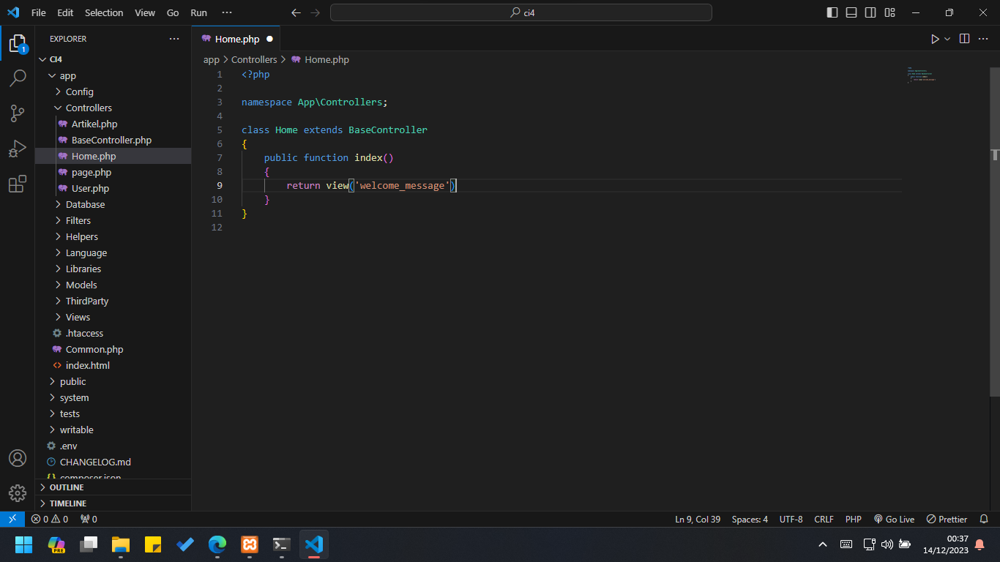

# lab11web
### Nama : Zalfa Dewi Zahrani
### Nim : 312210320
### Kelas : TI.22.A3


## MEMBUAT FOLDER BARU

Pertama, buatlah folder baru dengan nama Lab11_php_ci pada root directory web server(c:xampp/htdocs/Lab11Web)

Kemudian, sebelum memulai menggunakan Framework Codeigniter kita perlu melakukan konfigurasi dan juga mengaktifkan beberapa ekstentsi PHP seperti php-jose, php-mysqlnd, php-mxl, php-intl, dan libcurl.

## PENGAKTIFAN EKSTENTSI DENGAN XAMPP CONTROL PANEL

Untuk dapat mengaktifkannya kalian perlu masuk kedalam control panel xampp kemudian pada bagian apache klik Config > PHP.ini seperti gambar dibawah.



Setelahnya cukup hilangkan tanda ; pada ekstentsi yang akan diaktifkan seperti gambar dibawah. Kemudian simpan kembali file tersebut dan restart Apache web servernya.



## PENGINSTALLAN CODEIGNITER 4

Lakukan download pada codeigniter 4 dengan menggunakan website https://codeigniter.com/download


Pilih codeigniter 4 kemudian tekan download dan tunggu hingga terinstall.

## PROSES MENJALANKAN CLI (COMMAND LINE INTERFACE)

Codeigniter 4 menyediakan CLI untuk dapat mempermudah proses development. Untuk mengakses CLI bukalah terminal/command prompt. Kemudian arahkan lokasi direktori sesuai dengan direktori kerja project dibuat. (xampp/htdocs/Lab11Web/Lab11_php_ci/ci4)



Dan masukan perintah dibawah untuk dapat menjalankan guna memanggil CLI Codeigniter.

```php
php spark
```

## PENGAKTIFAN MODE DEBUGGING

Codeigniter 4 menyediakan fitur debugging untuk memudahkan developer untuk mengetahui pesan error apabila terjadi kesalahan dalam membuat kode program. Secara default fitur ini belum aktif. 

Maka untuk mengaktifkannya, Pertama ubahlah file env menjadi .env . Kemudian ubah nilai konfigurasi pada environment variable CI_ENVIRONMENT menjadi development seperti gambar berikut.


Selanjutnya hilangkanlah ; pada akhir kode ketika kalian membuka file app/Controller/Home.php seperti berikut.




Dan terjadilah error pada aplikasi yang akan ditampilkan pesan kesalahan seperti berikut.


## PEMBUATAN ROUTE BARU

Untuk menambahkan route baru cukup tambahkan kode berikut.

```php
$routes->get('/about', 'Page::about');
$routes->get('/contact', 'Page::contact');
$routes->get('/faqs', 'Page::faqs');
```

Kemudian buka CLI dan jalankan perintah tersebut. Jika mendapat tampilan seperti dibawah maka penambahan routes sudah benar.


Selanjutnya cobalah untuk mengakses route yang telah dibuat dengan mengakses alamat URL http://localhost:8080/about


Jika mendapat tampilan seperti diatas, maka artinya file atau pages tersebut tidak ada. Dan untuk dapat mengakses halaman tersebut, harus dibuat terlebih dahulu Controller yang sesuai dengan routing yang dibuat yaitu Controller Page.

## MEMBUAT CONTROLLER


Selanjutnya adalah membuat Controller Page seperti diatas. Buat file baru dengan nama page.php pada direktori Controller kemudian isi kodenya seperti berikut.

```php
<?php

namespace App\Controllers;

class Page extends BaseController
{
    public function about()
    {
        echo "INI HALAMAN ABOUT";
    }
    public function contact()
    {
        echo "INI HALAMAN CONTACT";
    }
    public function faqs()
    {
        echo "INI HALAMAN FAQ";
    }
}
```

## AUTO ROUTING

Secara default fitur autoroute pada Codeiginiter sudah aktif. Untuk mengubah status autoroutenya dapat diubah menggunakan nilai variabelnya. Dan ntuk menonaktifkannya ubah nilai true menjadi false.

```php
$routes->setAutoRoute(true);
```

Tambahkan method baru pada Controller Page seperti berikut.


## MEMBUAT VIEW


Selanjutnya adalah membuat view untuk tampilan web agar lebih menarik seperti diatas dengan membuat file baru dengan nama about.php pada direktori view (app/view/about.php) kemudian isi kodenya seperti berikut.

```php
public function about()
    {
        return view('about', [
            'title' => 'Halaman About',
            'content' => 'Ini adalah halaman about yang menjelaskan tentang isi halaman ini.'
        ]);
    }
```

## MEMBUAT LAYOUT WEB DENGAN CSS

Pada dasarnya layout web dengan css dapat diimplamentasikan dengan mudah pada codeigniter. Hanya saja yang perlu diketahui adalah, pada Codeigniter 4 file yang menyimpan asset css dan javascript terletak pada direktori public.

Pertama, buatlah file css pada direktori public dengan nama style.css lalu buat juga folder pada direktori view yang didalamnya diisi dengan file header.php dan juga footer.php

Isi bagian header dengan kode berikut.
```php
<!DOCTYPE html>
<html lang="en">
<head>
    <meta charset="UTF-8">
    <title><?= $title; ?></title>
    <link rel="stylesheet" href="<?= base_url('/style.css');?>">
</head>
<body>
    <div id="container">
    <header>
        <h1>Layout Sederhana</h1>
    </header>
    <nav>
        <a href="<?= base_url('/');?>" class="active">Home</a>
        <a href="<?= base_url('/artikel');?>">Artikel</a>
        <a href="<?= base_url('/about');?>">About</a>
        <a href="<?= base_url('/contact');?>">Kontak</a>
    </nav>
<section id="wrapper">
    <section id="main">
```

Dan isi bagian footer dengan kode berikut.
```php
</section>
    <aside id="sidebar">
        <div class="widget-box">
            <h3 class="title">Widget Header</h3>
            <ul>
                <li><a href="#">Widget Link</a></li>
                <li><a href="#">Widget Link</a></li>
            </ul>
        </div>
        <div class="widget-box">
            <h3 class="title">Widget Text</h3>
            <p>Vestibulum lorem elit, iaculis in nisl volutpat, malesuada
tincidunt arcu. Proin in leo fringilla, vestibulum mi porta, faucibus felis.
Integer pharetra est nunc, nec pretium nunc pretium ac.</p>
        </div>
    </aside>
</section>
<footer>
    <p>&copy; 2022 - Universitas Pelita Bangsa</p>
</footer>
</div>
</body>
</html>
```

Selanjutnya, ubahlah file about pada app view dengan kode berikut.

```php
<?= $this->include('template/header'); ?>

<h1><?= $title; ?></h1>
<hr>
<p><?= $content; ?></p>

<?= $this->include('template/footer'); ?>
```

Maka ketika halaman web tersebut kalian refresh, kalian akan mendapat tampilan seperti gambar dibawah ini.


# PRAKTIKUM 12

## MEMBUAT DATABASE : STUDI KASUS DATA ARTIKEL

Kalian bisa langsung saja membuat database pada PHPMyAdmin dengan mengklik tombol MySQL yang ada diatas kemudian masukan kode dibawah kemudian klik kirim.

```mysql
CREATE DATABASE lab_ci4;
```


## PEMBUATAN TABEL 


Setelah database berhasil dibuat. Selanjutnya proses pembuatan tabel pada database tersebut. Pembuatannya sama dengan sebelumnya, kalian hanya perlu menekan tombol MySQL pada Database sebelumnya kemudian masukan kode berikut:

```mysql
CREATE TABLE artikel (
    id INT(11) auto_increment,
    judul VARCHAR(200) NOT NULL,
    isi TEXT,
    gambar VARCHAR(200),
    status TINYINT(1) DEFAULT 0,
    slug VARCHAR(200),
    PRIMARY KEY(id)
);
```

## KONFIGURASI KONEKSI DATABASE

Konfigurasi dapat dilakukan dengan dua cara. Pertama, pada dua file app/config/database.php atau yang kedua menggunakan file .env seperti yang akan saya gunakan dengan menghapus tanda # pada bagian database seperti dibawah.


## MEMBUAT MODEL

Pembuatan model dilakukan untuk memproses artikel nantinya. Untuk pembuatan modelnya cukup dengan membuat file baru pada direktori app/models dengan nama ArtikelModel.php kemudian isi dengan kode berikut.

```php
<?php

namespace App\Models;

use CodeIgniter\Model;

class ArtikelModel extends Model
{
    protected $table = 'Artikel';
    protected $primaryKey = 'id';
    protected $useAutoIncrement = true;
    protected $allowedFields = ['Judul', 'Isi', 'status', 'Slug', 'Gambar'];
}
```

## MEMBUAT CONTROLLER

Buatlah kontroller baru pada direktori app/Controllers dengan nama Artikel.php kemudian masukan kode berikut.

```php
<?php

namespace App\Controllers;

use App\Models\ArtikelModel;

class Artikel extends BaseController
{

    public function index()
    {
        $title = 'Daftar Artikel';
        $model = new ArtikelModel();
        $artikel = $model->findAll();
        return view('artikel/index', compact('artikel', 'title'));
    }
}
```

## PEMBUATAN VIEW

Buatlah direktori baru dengan nama artikel pada direktori app/views yang kemudian didalamnya buatlah file dengan nama index.php yang diisi dengan kode berikut:

```php
<?= $this->include('template/header'); ?>

<?php if($artikel): foreach($artikel as $row): ?>
<article class="entry">
    <h2><a href="<?= base_url('/artikel/' . $row['slug']);?>"><?=$row['judul']; ?></a></h2>
    " alt="<?=$row['judul']; ?>">
    <p><?= substr($row['isi'], 0, 200); ?></p>
</article>
<hr class="divider" />
<?php endforeach; else: ?>
<article class="entry">
    <h2>Belum ada data.</h2>
</article>
<?php endif; ?>

<?= $this->include('template/footer'); ?>
```

Setelahnya refresh kembali browsernya dan kalian akan mendapatkan tampilan seperti gambar dibawah ini.


Tampilan diatas menampilkan bahwa belum satupun data yang ditampilkan, jadi cobalah tambahkan beberapa data pada database agar dapat ditampilkan datanya. Berikut kode yang digunakan:

```php
INSERT INTO artikel (judul, isi, slug) VALUE
('Artikel pertama', 'Lorem Ipsum adalah contoh teks atau dummy dalam industri percetakan dan penataan huruf atau typesetting. Lorem Ipsum telah menjadi standar contoh teks sejak tahun 1500an, saat seorang tukang cetak yang tidak dikenal mengambil sebuah kumpulan teks dan mengacaknya untuk menjadi sebuah
buku contoh huruf.', 'artikel-pertama'), ('Artikel kedua', 'Tidak seperti anggapan banyak orang, Lorem Ipsum bukanlah
teks-teks yang diacak. Ia berakar dari sebuah naskah sastra latin klasik dari era 45 sebelum masehi, hingga bisa dipastikan usianya telah mencapai lebih dari 2000 tahun.', 'artikel-kedua');
```

Refresh kembali browsernya dan akan menampilkan tampilan seperti ini.


## MEMBUAT TAMPILAN DETAIL ARTIKEL

Untuk membuat sebuah tampilan artikel yang mana ketika kita mengklik judul berita tersebut kita akan diarahkan kehalaman yang berbeda, cukup dengan menambahkan fungsi baru pada Controller Artikel dengan nama view(). Kemudian tambahkan kode berikut.

```php
public function view($slug)
    {
        $model = new ArtikelModel();
        $artikel = $model->where(['slug' => $slug])->first();
        
        // Menampilkan error apabila data tidak ada.
        if (!$artikel)
        {
            throw PageNotFoundException::forPageNotFound();
        }
        $title = $artikel['judul'];
        return view('artikel/detail', compact('artikel', 'title'));
    }
```

## MEMBUAT VIEW DETAIL

Buat view baru untuk halaman detail dengan nama app/views/artikel/detail.php kemudian memasukan kode berikut.

```php
<?= $this->include('template/header'); ?>

<article class="entry">
    <h2><?= $artikel['judul']; ?></h2>
    " alt="<?=$artikel['judul']; ?>">
    <p><?= $artikel['isi']; ?></p>
</article>

<?= $this->include('template/footer'); ?>
```

## MEMBUAT ROUTING UNTUK ARTIKEL DETAIL

Bukalah kembali file app/config/Routes.php kemudian tambahkan routing berikut untuk memunculkan artikel detail.

```php
$routes->get('/artikel/(:any)', 'Artikel::view/$1');
```

Setelah ditambahkan cek browser dengan URL http://localhost:8080/artikel/artikel-pertama dan inilah hasilnya


## MEMBUAT MENU ADMIN

Menu admin ini berfungsi sebagai salah satu proses CRUD data artikel. Cara membuatnya cukup buatlah method baru pada Controller Artikel dengan nama admin_index() menggunakan kode berikut.

```php
public function admin_index()
    {
        $title = 'Daftar Artikel';
        $model = new ArtikelModel();
        $artikel = $model->findAll();
        return view('artikel/admin_index', compact('artikel', 'title'));
    }
```

Selanjutnya buat view untuk dapat membuat tampilan admin dengan nama admin_index.php, kemudian masukan kode berikut

```php
<?= $this->include('template/admin_header'); ?>

<table class="table">
    <thead>
        <tr>
            <th>ID</th>
            <th>Judul</th>
            <th>Status</th>
            <th>AKsi</th>
        </tr>
    </thead>
    <tbody>
    <?php if($artikel): foreach($artikel as $row): ?>
    <tr>
        <td><?= $row['id']; ?></td>
        <td>
            <b><?= $row['judul']; ?></b>
            <p><small><?= substr($row['isi'], 0, 50); ?></small></p>
        </td>
        <td><?= $row['status']; ?></td>
        <td>
            <a class="btn" href="<?= base_url('/admin/artikel/edit/' .
$row['id']);?>">Ubah</a>
            <a class="btn btn-danger" onclick="return confirm('Yakin
menghapus data?');" href="<?= base_url('/admin/artikel/delete/' .
$row['id']);?>">Hapus</a>
        </td>
    </tr>
    <?php endforeach; else: ?>
    <tr>
        <td colspan="4">Belum ada data.</td>
    </tr>
    <?php endif; ?>
    </tbody>
    <tfoot>
        <tr>
            <th>ID</th>
            <th>Judul</th>
            <th>Status</th>
            <th>AKsi</th>
        </tr>
    </tfoot>
</table>

<?= $this->include('template/admin_footer'); ?>
```

Kemudian tambahkanlah routing untuk menu admin seperti berikut

```php
$routes->group('admin', function($routes) {
    $routes->get('artikel', 'Artikel::admin_index');
    $routes->add('artikel/add', 'Artikel::add');
    $routes->add('artikel/edit/(:any)', 'Artikel::edit/$1');
    $routes->get('artikel/delete/(:any)', 'Artikel::delete/$1');
});
```


Setelah ditambahkan akseslah menu admin untuk dapat melihat hasil seperti diatas dengan menggunakan URL http://localhost:8080/admin/artikel/


## MENAMBAHKAN DATA ARTIKEL

Untuk menambahkannnya cukup dengan tambahkan fungsi/method baru pada Controller Artikel dengan nama add() dengan kode sebagai berikut.

```php
public function add()
    {
        // validasi data.
        $validation = \Config\Services::validation();
        $validation->setRules(['judul' => 'required']);
        $isDataValid = $validation->withRequest($this->request)->run();

        if ($isDataValid)
        {
        $artikel = new ArtikelModel();
        $artikel->insert([
            'judul' => $this->request->getPost('judul'),
            'isi' => $this->request->getPost('isi'),
            'slug' => url_title($this->request->getPost('judul')),
        ]);
        return redirect('admin/artikel');
        }
        $title = "Tambah Artikel";
        return view('artikel/form_add', compact('title'));
    }
```


Kemudian buatlah view atau tampilan seperti diatas untuk form tambahan dengan nama form_add.php yang diisi dengan kode berikut.

```php
<?= $this->include('template/admin_header'); ?>

<h2><?= $title; ?></h2>
<form action="" method="post">
    <p>
        <input type="text" name="judul">
    </p>
    <p>
        <textarea name="isi" cols="50" rows="10"></textarea>
    </p>
    <p><input type="submit" value="Kirim" class="btn btn-large"></p>
</form>

<?= $this->include('template/admin_footer'); ?>
```

## MENGUBAH DATA

Untuk mengubah data cukup dengan menambahkan fungsi/method baru pada Controller Artikel dengan nama edit() dengan kode berikut

```php
public function edit($id)
    {
        $artikel = new ArtikelModel();
        
        // validasi data.
        $validation = \Config\Services::validation();
        $validation->setRules(['judul' => 'required']);
        $isDataValid = $validation->withRequest($this->request)->run();

        if ($isDataValid)
        {
            $artikel->update($id, [
                'judul' => $this->request->getPost('judul'),
                'isi' => $this->request->getPost('isi'),
            ]);
            return redirect('admin/artikel');
        }

        // ambil data lama
        $data = $artikel->where('id', $id)->first();
        $title = "Edit Artikel";
        return view('artikel/form_edit', compact('title', 'data'));
    }
```


Kemudian buatlah tampilan seperti diatas untuk form tambah dengan nama form_edit.php yang diisi dengan kode berikut.

```php
<?= $this->include('template/admin_header'); ?>

<h2><?= $title; ?></h2>
<form action="" method="post">
    <p>
        <input type="text" name="judul" value="<?= $data['judul'];?>" >
    </p>
    <p>
        <textarea name="isi" cols="50" rows="10"><?=
$data['isi'];?></textarea>
    </p>
    <p><input type="submit" value="Kirim" class="btn btn-large"></p>
</form>

<?= $this->include('template/admin_footer'); ?>
```

## MENGHAPUS DATA

Hapus data dengan menambahkan fungsi/method baru pada Controller Artikel dengan nama delete() dengan kode berikut.

```php
public function delete($id)
    {
        $artikel = new ArtikelModel();
        $artikel->delete($id);
        return redirect('admin/artikel');
    }
```

# PERTANYAAN DAN TUGAS

Selesaikan programnya sesuai Langkah-langkah yang ada. Anda boleh melakukan improvisasi.


# PRAKTIKUM 13

## MEMBUAT TABEL : USER LOGIN


Kalian bisa langsung saja membuat sebuah tabel pada PHPMyAdmin dengan mengklik tombol MySQL yang ada diatas kemudian masukan kode dibawah kemudian klik kirim.

```mysql
CREATE TABLE user (
    id INT(11) auto_increment,
    username VARCHAR(200) NOT NULL,
    useremail VARCHAR(200),
    userpassword VARCHAR(200),
    PRIMARY KEY(id)
);
```

## MEMBUAT MODEL USER

Selanjutnya buatlah model untuk memproses data login dengan membuat sebuah file baru pada direktori app/Models dengan nama UserModel.php yang diisi dengan kode berikut.

```php
<?php

namespace App\Models;

use CodeIgniter\Model;

class UserModel extends Model
{
    protected $table = 'user';
    protected $primaryKey = 'id';
    protected $useAutoIncrement = true;
    protected $allowedFields = ['username', 'useremail', 'userpassword'];
}
```

## MEMBUAT CONTROLLER USER

Buatlah controller baru dengan nama User.php pada direktori app/Controllers. Kemudian tambahkan method index() untuk menampilkan daftar user dan method login() untuk proses login dengan memasukan kode berikut.

```php
<?php

namespace App\Controllers;

use App\Models\UserModel;

class User extends BaseController
{
    public function index()
    {
        $title = 'Daftar User';
        $model = new UserModel();
        $users = $model->findAll();
        return view('user/index', compact('users', 'title'));
    }

    public function login()
    {
        helper(['form']);
        $email = $this->request->getPost('email');
        $password = $this->request->getPost('password');
        if (!$email)
        {
            return view('user/login');
        }

        $session = session();
        $model = new UserModel();
        $login = $model->where('useremail', $email)->first();
        if ($login)
        {
            $pass = $login['userpassword'];
            if (password_verify($password, $pass))
            {
                $login_data = [
                    'user_id' => $login['id'],
                    'user_name' => $login['username'],
                    'user_email' => $login['useremail'],
                    'logged_in' => TRUE,
                ];
                $session->set($login_data);
                return redirect('admin/artikel');
            }
            else
            {
                $session->setFlashdata("flash_msg", "Password salah.");
                return redirect()->to('/user/login');
            }
        }
        else
        {
            $session->setFlashdata("flash_msg", "email tidak terdaftar.");
            return redirect()->to('/user/login');
        }
    }
}
```

## MEMBUAT VIEW LOGIN

Buatlah direktori baru dengan nama user pada direktori app/views, kemudian buatlah sebuah file baru dengan nama login.php menggunakan kode berikut.

```php
<!DOCTYPE html>
<html lang="en">
<head>
    <meta charset="UTF-8">
    <title>Login</title>
    <link rel="stylesheet" href="<?= base_url('/style.css');?>">
</head>
<body>
    <div id="login-wrapper">
        <h1>Sign In</h1>
        <?php if(session()->getFlashdata('flash_msg')):?>
            <div class="alert alert-danger"><?=
session()->getFlashdata('flash_msg') ?></div>
        <?php endif;?>
        <form action="" method="post">
            <div class="mb-3">
                <label for="InputForEmail" class="form-label">Email
address</label>
                <input type="email" name="email" class="form-control"
id="InputForEmail" value="<?= set_value('email') ?>">
            </div>
            <div class="mb-3">
                <label for="InputForPassword"
class="form-label">Password</label>
                    <input type="password" name="password"
class="form-control" id="InputForPassword">
                </div>
                <button type="submit" class="btn
btn-primary">Login</button>
            </form>
    </div>
</body>
</html>
```

## MEMBUAT DATABASE SEEDER

Database ini digunakan untuk membuat data dummy. Untuk mencobanya kita perlu memasukan data user dan password kedalam database. Untuk itu buatlah database seeder untuk tabel user. Bukalah CLI kemudia tulis perintah berikut.

```
php spark make:seeder UserSeeder
```


Selanjutnya, bukalah file UserSeeder.php yang berada pada direktori app/Database/Seeds/UserSeeder.php kemudian isi dengan kode berikut ini.

```php
<?php

namespace App\Database\Seeds;

use CodeIgniter\Database\Seeder;

class UserSeeder extends Seeder
{
    public function run()
    {
        $model = model('UserModel');
        $model->insert([
            'username' => 'admin',
            'useremail' => 'admin@email.com',
            'userpassword' => password_hash('admin123', PASSWORD_DEFAULT),
        ]);
    }
}
```

Selanjutnya buka kembali CLI dan ketikan perintah berikut.

```
php spark db:seed UserSeeder
```

Setelah menambahkan perintah tersebut bukalah browser untuk melakukan pengecekan dengan menggunakan URL http://localhost:8080/user/login seperti inilah tampilan yang dihasilkan.


## MENAMBAHKAN AUTH FILTER

Untuk halaman admin selanjutnya buatlah file baru dengan nama Auth.php pada direktori app/Filters. Kemudian tambahkan kode berikut ini.

```php
<?php namespace App\Filters;

use CodeIgniter\HTTP\RequestInterface;
use CodeIgniter\HTTP\ResponseInterface;
use CodeIgniter\Filters\FilterInterface;

class Auth implements FilterInterface
{
    public function before(RequestInterface $request, $arguments = null)
    {
        // jika user belum login
        if(! session()->get('logged_in')){
            // maka redirct ke halaman login
            return redirect()->to('/user/login');
        }
    }

    public function after(RequestInterface $request, ResponseInterface
$response, $arguments = null)
    {
        // Do something here
    }
}
```

Selanjutnya bukalah file app/config/Filters.php kemudian tambahkan kode berikut ke dalamnya.

```php
'auth' => App\Filters\Auth::class
```

Setelahnya buka file app/Config/Routes.php dan sesuaikanlah kodenya seperti gambar dibawah.


## PERCOBAAN AKSES MENU ADMIN

Bukalah URL dengan alamat http://localhost:8080/user/login dan ketika alamat tersebut diakses maka akan muncul tampilan halaman login seperti berikut.


Setelah mendapat tampilan diatas, loginlah menggunakan email adress dan password yang sudah disetting sebelumnya dan inilah tampilan yang dihasilkan ketika kalian sudah berhasil login.


## FUNGSI LOGOUT

Tambahkanlah method logout pada Controller User seperti berikut:

```php
    public function logout()
    {
        session()->destroy();
        return redirect()->to('/user/login');
    }
```

# PERTANYAAN DAN TUGAS

Selesaikan programnya sesuai Langkah-langkah yang ada. Anda boleh melakukan improvisasi.


# PRAKTIKUM 14 
# PAGINATION DAN PENCARIAN

## PEMBUATAN PAGINATION

Pagination itu sendiri merupakan proses yang digunakan untuk membatasi tampilan yang panjang dari data yang banyak pada sebuah website. Fungsi pagination juga ialah memecah tampilan menjadi beberapa halaman tergantung banyaknya data yang akan ditampilkan pada setiap halaman yang mana fungsi tersebut sudah tersedia di dalam Library pada Codeigniter 4.

Untuk dapat membuatnya, silahkan buka kembali Controller Artikel, kemudia modifikasilah kode pada method admin_index seperti berikut.

```php
public function admin_index()
    {
        $title = 'Daftar Artikel';
        $model = new ArtikelModel();
        $data = [
            'title' => $title,
            'artikel' => $model->paginate(2), #data dibatasi 2 record per halaman
            'pager' => $model->pager,
        ];
        return view('artikel/admin_index', $data);
    }
```

Kemudian bukalah file views/artikel/admin_index.php dan tambahkan kode dibawah ini.

```php
<?= $pager->links(); ?>
```

Lalu tambahkanlah data baru dan buka kembalilah menu daftar artikel pada browser untuk melihat hasilnya.


## MEMBUAT PENCARIAN

Sebuah pencarian data yang digunakan untuk memfilter data yang dibuat dengan cara membuka kembali pada Controller Artikel, dan mengubah sebuah kode didalam admin_index menjadi seperti ini.

```php
public function admin_index()
{
	 $title = 'Daftar Artikel';
	 $q = $this->request->getVar('q') ?? '';
	 $model = new ArtikelModel();
	 $data = [
	 'title' => $title,
	 'q' => $q,
	 'artikel' => $model->like('judul', $q)->paginate(2), # data dibatasi 2 record per halaman
	 'pager' => $model->pager,
	 ];
	 return view('artikel/admin_index', $data);
}
```

Kemudian buka kembali file views/artikel;/admin_index.php dan tambahkalan pencarian sebelum deklarasi tabel seperti berikut ini.

```php
<form method="get" class="form-search">
   <input type="text" name="q" value="<?= $q; ?>" placeholder="Cari data">
   <input type="submit" value="Cari" class="btn btn-primary">
</form>
```

Dan ubahlah link pager menjadi seperti ini.

```php
<?= $pager->only(['q'])->links(); ?>
```

Maka seperti inilah tampilan yang dihasilkan.


## UPLOAD GAMBAR


Untuk menambahkan fungsi upload gambar pada tambah artikel seperti diatas, bukalah kembali Controller Artikel dan sesuaikan kodenya pada method menjadi add menjadi seperti ini.

```php
public function add()
    {
        // validasi data.
        $validation = \Config\Services::validation();
        $validation->setRules(['judul' => 'required']);
        $isDataValid = $validation->withRequest($this->request)->run();
        
        if ($isDataValid)
        {
            $file = $this->request->getFile('gambar');
            $file->move(ROOTPATH . 'public/gambar');
            
            $artikel = new ArtikelModel();
            $artikel->insert([
                'judul' => $this->request->getPost('judul'),
                'isi' => $this->request->getPost('isi'),
                'slug' => url_title($this->request->getPost('judul')),
                'gambar' => $file->getName(),
            ]);
            return redirect('admin/artikel');
        }
        $title = "Tambah Artikel";
        return view('artikel/form_add', compact('title'));
    }
```

Kemudian tambahkan file input file seperti ini pada views/artikel/form_add.php

```php
<p>
      <input type="file" name="gambar">
 </p>
```

Sesuaikan juga tag form dengan menambahkan sebuah ecrypt type seperti berikut.

```php
<form action="" method="post" enctype="multipart/form-data">
```

# PERTANYAAN DAN TUGAS

Selesaikan programnya sesuai Langkah-langkah yang ada. Anda boleh melakukan
improvisasi.


# <P align="center"> THANK'S FOR YOUR ATTENTION!! SEE YOU!!

